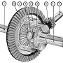

#  OpenDiff draft proposal

Historically, version control tools have been focused on source code.  As a result, if you tried to put a spreadsheet, CAD model, or some other non-plaintext file into your code repository, many pieces of the version control system would stop working.  `git log`, `git diff` - these commands can only show changes in text files.

DiffPlug changes that by exposing an entirely visual interface to version control.  This makes it possible to put anything into version control, and it lets anyone - even mechanical engineers, circuit designers, and financial analysts - work like a programmer.

In order for this to work, there must be a plugin for every file format.  If these plugins are designed well, they should work with any version control system (git, svn, dropbox, plain-old user-defined diffs, and as-yet-uninvented version control systems), and they should work in any host (they shouldn't be tied to DiffPlug or any other proprietary host vendor).

We would like to build an open source API and sample client which allows anyone to build differs which are capable of the following high-level operations:

- View any file in history
	+ `void showSingle(Rectangle viewerArea, Snapshot model);`
	+ Given a rectangle and a stream of bytes, display the file in the rectangle.
- Display a diff of any files in history, including symmetric diff, before/after diff, 3-way, and n-way.
	+ `void showDiff(Rectangle viewerArea, SnapshotFamily models);`
	+ Given a rectangle and multiple streams of bytes, display the files and their differences in the rectangle.
- Merge (including merge, rebase, apply, unapply, cherry-pick, revert, etc)
	+ `EditScript createEdit(Snapshot before, Snapshot after)`
	+ `Snapshot apply(Snapshot before, EditScript edit) throws ConflictException`
	+ `Snapshot unapply(Snapshot after, EditScript edit) throws ConflictException`

Although this api will not be tied to any specific version control system, such a system is required to have some kind of UI.  To maximize flexibility for plugin implementors, the "lowest common denominator" of this API will be built using Java and [SWT](https://www.eclipse.org/swt/).  This approach allows implementors to use any of the following UI technologies:

- SWT using any JVM language - Java, Scala, Jython, JRuby, Ceylon, Groovy, Clojure, Kotlin, and many others.
- HTML5 using an embedded browser - [example](https://javahacks.wordpress.com/2014/09/09/java-based-desktop-apps-using-swt-and-xulrunner/)
- Platform-specific code which grabs pointers from SWT widgets - [example](http://stackoverflow.com/questions/28639592/embed-swt-composite-into-c-sharp-application)

This design means that a host based on SWT (such as DiffPlug or Eclipse) could use any plugin, and a host based on HTML5 (such as a web interface or GitHub's Atom editor) could use any HTML5-based plugin.

Here at DiffPlug we've spent the last 5 years building the infrastructure and experience to make this API possible:

- We ship a version control tool which is [agnostic to the underlying storage](https://docs.diffplug.com/1.5.0/Filesystems/)
- We ship a diff tool which is used every day by industry heavyweights and regulatory bodies to diff [complex structured documents](https://docs.diffplug.com/1.5.0/ViewerDiffers/SimulinkViewerDiffer/)
- We have released much of our core infrastructure as open source
	+ [durian](https://github.com/diffplug/durian) - Guava's spikier (unofficial) cousin
	+ [durian-rx](https://github.com/diffplug/durian-rx) - Reactive getters, powered by RxJava and ListenableFuture
	+ [durian-swt](https://github.com/diffplug/durian-swt) - Reactive utilities and fluent builders for SWT
- We have collaborated with the community to release infrastructure which makes contributing to other open source projects easier
	+ [spotless](https://github.com/diffplug/spotless) - Keep your code spotless with Gradle

Combining these skills, we have all the pieces necessary to enable an ecosystem of differs which will bring the decentralized workflow of programmers to the world at large.  This API will be licensed under Apache 2.0 (like all the rest of our open source projects).  It will include at least one test host and at least one test plugin, so that implementors of either side of the API will have a reference client for the other side.

If you would like to see this API come to life, please [support us on KickStarter](https://www.kickstarter.com/projects/1073181831/1614770867/).
